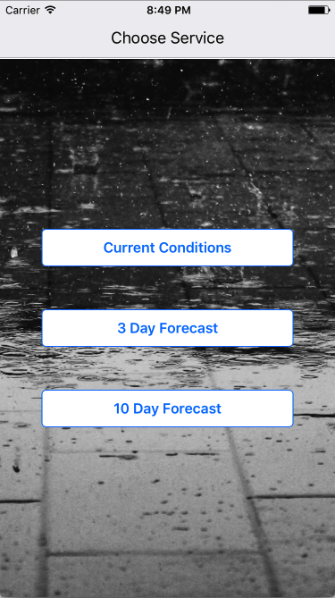

#Reactive Weather
##A simple weather app built using React Native, Redux, and the Wunderground API.
______________________________________________________________________________________________________________________

  

##Introduction
###This weather app was built as part of a challenge to build a full MVP native app within 3 days. I was able to get the app from a concept to a fully functional product within the time limit. 

  

##Technical
###Currently only supports ios. 
###Built using:
###-React Native
###-Redux
###-React Native Router Flux
###-Axios
###-Wunderground API

 

##Installation
###The app will be on the ios app store shortly. Will add local installation instructions soon!

